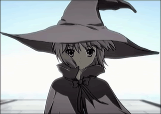

> *A famous colleague once sent an actually very well-written paper he was quite proud of to a famous complexity theorist. His answer: “I can’t find a theorem in the paper. I have no idea what this paper is about.”*
# Appendix A: 2.0

*This appendix speedruns deep learning prerequisites by using language modeling as a running example.*
By the end of the appendix you should be comfortable with state of the art open
source models such as [llama](https://arxiv.org/abs/2407.21783) and [r1](https://arxiv.org/abs/2501.12948).

Although the appendix serves as foundational material for the deep learning
framework in the core syllabus, it will not be in any means foundational to the
theoretician-inclined reader. That is, the appendix will not model peano axioms 
in order to justify the use of numbers, abstract vector spaces to use
n-dimensional euclidean space, tensor products to use ndarrays, linear operators
on vector spaces to use derivatives. The target readers are working
mathematicians and [concrete](https://en.wikipedia.org/wiki/Concrete_Mathematics)
computer scientists, and so concepts are defined by their
**internal structure of concrete implementations** rather than their
**external properties of abstract interfaces**.

**Contents**
1. [probability: language modeling]()
2. [statistical learning: linear ->  non-linear](#part-1--statistical-learning-linear-to-non-linear)
3. [deep learning: from ffn to gpt](#part-2--deep-learning-from-ffn-to-gpt)
4. [attention is all you need]()
5. [return of the rl]()
6. [references](#part-7--references)

## Part 1 — probability: language modeling
By default, mathematical reasoning is understood to be deterministic where
a **statement** $S$ is either true (holds) or false (does not hold). Any
**variable** $x$ can only take on one specific value at a time. However there are
other times where what's desirable is describing phenomena that is in fact
non-deterministic (while still remaining precise). Even if base reality turns
out to be deterministic, in practice there are many scenarios where carrying
out calculation is intractable. i.e, predicting tomorrow's weather with the
position of every water molecule.

The most widely adopted mathematical language for formalizing our intuitions
around non-deterministic stochastic phenomena is probability theory (as opposed
to alternative frameworks such as [probabilistic logic](https://en.wikipedia.org/wiki/Probabilistic_logic) or
[uncertainty quantification](https://en.wikipedia.org/wiki/Uncertainty_quantification)).
In probability theory  **statements** $S$ are neither true nor false. Rather,
truth is distributed across a weighted set of **random events** $E$. Similarly,
**random variables** $X$ do not take on a definite value but rather a set of
values.

We eschew measure-theoretic models of probability theory where the set $\Omega$,
a $\sigma$-algebra $\mathcal{F}$ and probability measure $P: \mathcal{F} \to [0,1]$
formalize a probability space $(\Omega, \mathcal{F}, P)$. For the more
theoretically inclined we point to Tao's [excellent](https://terrytao.wordpress.com/2010/01/01/254a-notes-0-a-review-of-probability-theory/)
[treatments](https://terrytao.wordpress.com/2015/09/29/275a-notes-0-foundations-of-probability-theory/)
of formalizing foundational probabilistic concepts and operations that are
preserved with respect to extension of the underlying sample space.


### Example 1:  "fresh" lyrics crodie

```
P("
  i got an empire of emotion,
  a monopoly on lotion,
  in a state of commotion,
  i gesture at the notion.
")

P("
  i got an empire of emotion,
  squad see me cruisin', cruisin' in my go kart,
  i'm war, ho, i'm warhol,
  i'm wario when i'm in mario kart.
")
```


<!-- Even though working mathematicians primarily use **random events** and
**random variables** on a daily basis, it's useful to define the abstract
probability space (TODO: why): a triplet $(\Omega, \mathcal{F}, P)$ that
comprises a sample space $\Omega$, an event space $\mathcal{F}$, and a measure
$P: \mathcal{F} \to [0,1]$. -->

<!-- TODO: measurable axioms? -->
<!-- 
1. the **sample space** $\Omega$ is the **set** of all possible **outcomes**
2. the **event space** $\mathcal{F}$ is the **power set** $2^\Omega$ of all possible **subsets**

where coloquially the *sample space* is referred to as the *vocabulary* of *words*,
and the *event space* is all possible (permutations, combinations?) *sentences*.

If the *experiment* is to sample a single word from the
english corpus then $\Omega=\{a, aardvark, ... zygote\}$ and $\mathcal{F}$ = $2^\Omega$.
An event $E$ where sampling a single word that starts with the letter j is the
sample space subset $E=\{j, jaguar, \ldots, jynx\}$.


What is counterintuitive at first is that the **outcomes** of the sample space
can be *tuples* themselves. That is, the experiment can be the roll of two dice,
three dice, four cards, five words, etc. For instance, the sample space can look
like $\Omega=\{(a,a), (a, aardvark), \ldots, (zygote, zygote)\}$. An event $F$
where **each** word starts with the letter j is the subset (of the sample space) $F=\{(j,j), \ldots (jy, jy) \}$.

TODO:
1. random variables as different "attributes" of an event.
with one sample space (and it's event space), there can be multiple rv's defined.
- people in car.
- fuel in the car.
- mileage traveled by car.
- wavelength of car color.
2.  random variables are neither "random" nor "variables". they are mappings from events to real number line.

3. formalizing probability spaces let us construct different sample spaces

3. the **probability function** $P: \mathcal{F} \to [0,1]$ is the **function** that produces the size of any **event (subset)** $E$ relative to the **event space (power set)** $\mathcal{F}$

interpret this to be the **chance** of an **event** occuring.
- measure size of event to event space?
- relative frequency in the limit? todo: justify. -->

<!-- A mathematically inclined rapper wants to formalize their intuition on what he
believes to be an "original" set of lyrics by measuring the **relative frequency**
of the lyrics with respect to the entire english corpus. He remembers probability
theory can help. As a well-trained mathematician, he starts off simple by
decomposing the problem from assessing an *entire rap* to that of a *single word*.

He wants a reuasable function where he can pass in *any event*
(in the rapper's case a single word) and a *probability* is returned. This motivates
**random variables** and their **distributions**.

A **random variable** is a mapping

**events**.


That is, he
wants some function that summarizes the entire experiment (in the rapper's case, sampling any word from english).

 How is this possible when
the domain of $P$ is $\mathcal{F}$. The answer, is with random variables.

A random variable can take on events. We will differentiate the two by denoting
the former with $X$, $Y$, $Z$, and the latter with $A$, $B$, $C$, $E$. -->


<!-- Formalizing $P$ as $P(E) = \lim_{n\to\infty} \frac{|E|}{n}$
places the foundations of probability on top of set theory with the following
three axioms:

1. $0 \leq P(E) \leq 1$
2. $P(\Omega) = 1$
3. $P(A \cup B ) = P(A) + P(B)$ if events A and B are mutually exclusive -->

<!-- section 2: *random variables* and their *distributions* (pmf. pdf).
random variable is a misnomer.
section 3: *probabilistic models: n random variables. joint probability distribution*

then intuitively we expect $P(A)$ is higher than $P(B)$ and would conclude that
the second set of lyrics are more "fresh". But how do we access $P$, allowing us
to reduce our common sense into calculation?
$X is a random variable$
$Let the event A be X="empire"$ apply a boolean operator to the RV.
$Let the event B be X>="e"$
$P(X="empire")$ is the probability of an event. remember P is only defined on event space -> [0,1]
$P(X=k)$ is the probability mass function. all events the random variable can take on is summarized with this single function.
if continuous then probability density function.

functions can be represented with
- equations
- code
- charts (2D. 3D)
any way of representing gives you the relationship between the events and measures.
language model is the function $P(X=k)$. -->

<!-- $$
\begin{align*}
&P(Y=🌭|\textbf{X}=\textbf{x};\theta) := \sigma(\theta^{\top}\textbf{x}) \underset{total\ law}{\implies} P(Y=¬🌭|\textbf{X}=\textbf{x};\theta) = 1 - \sigma(\theta^{\top}\textbf{x}) \\
\implies &P(Y=c|\textbf{X}=\textbf{x};θ) = \hat{y}^y (1-\hat{y})^{1-y} = \sigma(\theta^{\top}\textbf{x})^y [1-\sigma(\theta^{\top}\textbf{x})]^{1-y} \tag*{[continuous]}\\
\end{align*}
$$ -->

<!-- In order to define notions such as expectation, variance, and other computable
estimators, we map the sample space to the real number line using a random variable. -->

<!-- Random variables. Probability mass function.
Probability distributions:
Distributions are characterized by their parameters.

running example is autoregressive language modelling.
ngram model becomes intractable. time O(?). space O(?)
In the case of language modelling, ex... probability space is token space... -->

```python
message = "Hello, world!"

print(message)
```


**Statistics** on the other hand formalizes the recovery of parameters which
characterize the underlying probability distributions that generate the observed
data. Once recovered, we can sample from the distribution it in order to generate
predictions.

*Linear parametric models*:
*Non-linear parametric models*:

show manim animation

## Part 2 — deep learning: from ffn to gpt
```python
"""
Dimension key:
B: batch size
T: sequence length
V: vocabulary size
E: embedding dimension (E != D)
D: model dimension
"""

import picograd
# from jaxtyping import

# *********************MODEL*********************
B, T = 32, 3
V, E, D = 27, 10, 200

class Linear:
  def __init__(self, D_in, D_out, bias=True):
    self.W_DiDo = picograd.randn((D_in, D_out)) * 0.01
    self.b_Do = picograd.zeros(D_out) if bias else None

  def __call__(self, X_Di):
    self.X_Do = X_Di @ self.W_DiDo
    if self.b_Do is not None: self.X_Do += self.b_Do
    self.out = self.X_Do
    return self.X_Do

  def parameters(self):
    return [self.W_DiDo] + ([] if self.b_Do is None else [self.b_Do])

class Tanh:
  def __call__(self, X_BD):
    self.X_BD = picograd.tanh(X_BD)
    self.out = self.X_BD
    return self.X_BD
  
  def parameters(self):
    return []

model = [
  Linear(T * E, D, bias=False), Tanh(),
  Linear(D, D, bias=False), Tanh(),
  Linear(D, V, bias=False)
]

C_VE = picograd.randn((V,E)) #, generator=g)
params = [C_VE] + [p for l in model for p in l.parameters()]
for p in params:
    p.requires_grad = True

print("model loaded to cpu")


# *********************INFERENCE LOOP*********************
for _ in range(20): # 20 samples
  output, context = [], [0] * T
  while True:
    X_1T = picograd.tensor([context]) # B=1 for inference, T=3, in [0..27] (set to 0 for init)
    X_1TE = C_VE[X_1T] # using 0..27 as indices into C_VE for each B=1 example of context length T
    X_1cTE = X_1TE.view(-1, T*E) # B=1, TE
    X = X_1cTE

    for h in model:
      X = h(X)

    y_hat = F.softmax(X, dim=1)

    # sample and autoregressively update context
    token = picograd.multinomial(y_hat, num_samples=1, replacement=True).item()#, generator=g).item()
    context = context[1:] + [token]
    output.append(decode[token])
    if token == 0:
        break
  print(''.join(output))
```


## Part 3 — attention is all you need

Within the GPTs, we saw the rise of [sparse attention](https://arxiv.org/abs/1904.10509).
BERT variants showed us how [layer normalization](https://arxiv.org/abs/1607.06450) evolved into [RMSNorm](https://arxiv.org/abs/1910.07467).
LLaMA iterations demonstrated the progression from standard attention to [grouped-query attention](https://arxiv.org/abs/1910.07467).
DeepSeek’s releases, particularly constrained by hardware limitations, showed algorithms that enabled frontier performance without frontier compute.


<!-- 0. [ffn]()
1. [rnn]()
2. [lstm]()
3. [gpt]()
4. [beyond gpt]() -->

<!-- ## Part 0: non-linear parametric models: `nn.Linear()`, `nn.ReLU()` -->
<!-- Before jumping into the implementation of our deep learning framework's
multidimensional array with autodifferentiation capability, let's review the
mathematics of neural networks. We will incrementally construct a family of
functions from logistic regression, multiclass regression, feedforward
neural networks, attention and chain of thought variants, all for the
classification setting where Y⊆ℕ.

Recall that the logistic regression model for binary classification recovers the
bernouilli distribution $\mathbb{P}: \mathbb{R}^d \to [0,1]$ by assuming -->

<!-- $$
\begin{align*}
\implies \mathbb{P}(Y=y|\textbf{X}=\textbf{x};θ) &= \hat{y}^y (1-\hat{y})^{1-y} \\
                 &= \sigma(\textbf{w}^{\top}\textbf{x})^y [1-\sigma(\textbf{w}^{\top}\textbf{x})]^{1-y}
\end{align*}
$$ -->


## Part 7 — references

*Probability Theory*
1. [Piech 2024](https://chrispiech.github.io/probabilityForComputerScientists/en/)
1. [Harchol-Balter 2024](https://www.cs.cmu.edu/~harchol/Probability/book.html)

*Matrix Calculus*
1. [Kang, Cho 2024](https://kyunghyuncho.me/linear-algebra-for-data-science/)
1. [Bright, Edelman, Johnson 2025](https://arxiv.org/abs/2501.14787)

*Deep Learning*
1. [Cho 2015](https://arxiv.org/abs/1511.07916)
1. [Goodfellow et al. 2016](https://www.deeplearningbook.org/)
1. [Hardt, Recht 2022](https://mlstory.org/)
1. [Recht 2023](https://www.argmin.net/p/patterns-predictions-and-actions)
1. [Bach 2024](https://www.di.ens.fr/~fbach/ltfp_book.pdf)
1. [Jurafsky, Martin 2025](https://web.stanford.edu/~jurafsky/slp3/)
1. [Prince 2025](https://udlbook.github.io/udlbook/)