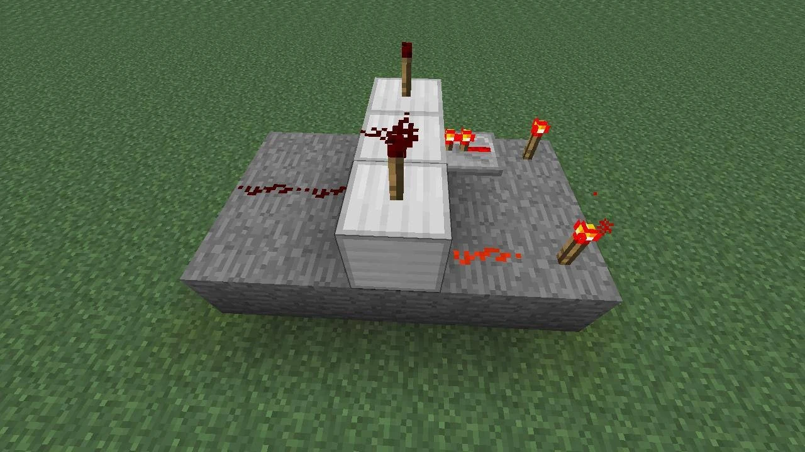

> and the universe said I love you 
> and the universe said you have played the game well 
> and the universe said everything you need is within you 
> and the universe said you are stronger than you know 
> and the universe said you are the daylight 
> and the universe said you are the night 
> and the universe said the darkness you fight is within you 
> and the universe said the light you seek is within you 
> and the universe said you are not alone 
> and the universe said you are not separate from every other thing 
> and the universe said you are the universe tasting itself, talking to itself, reading its own code 
> and the universe said I love you because you are love.
# Chapter 3: pt2
**This chapter implements a compiler for neural networks (pytorch2).** This
compiler will translate a pytorch-like API to a triton-like tiling language. If
you prefer to learn "top-down", read chapter 2 followed by chapter 3. If you
prefer to learn "bottom-up", read chapter 3 followed by chapter 2.
