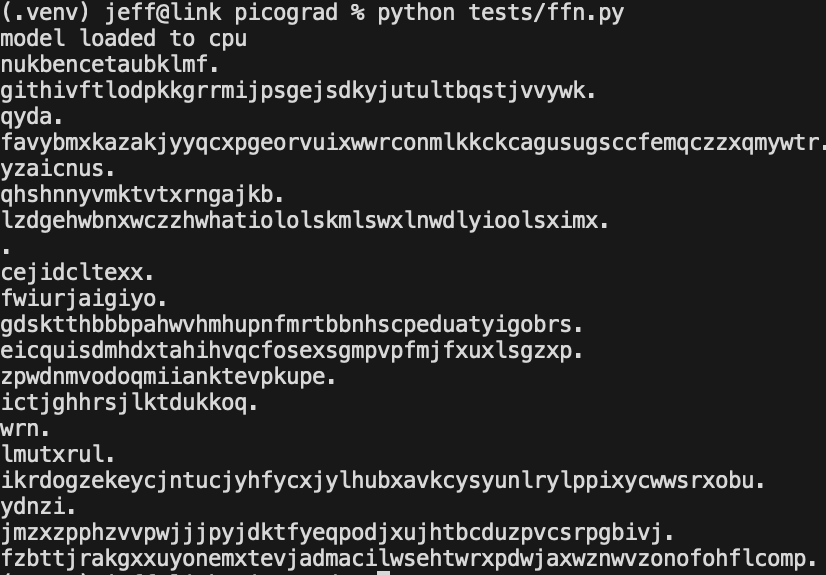

<!-- .avif)
> *Unfortunately, no one can be told what The Matrix is. You have to see it for yourself.* — Morpheus -->
# 8. Tensor Compilers

*This chapter implements an interpreter for neural network.*
By the end of this chapter, you will have a working implementation of the
multidimensional array abstraction pioneered by [numpy](https://numpy.org/doc/stable/reference/arrays.ndarray.html#), and autodifferentiation pioneered by [HIPS autograd](https://videolectures.net/videos/deeplearning2017_johnson_automatic_differentiation).

**Contents**
1. [nd: forward pass with `loss = model(x)`]()
2. [dfdx(nd): backward pass with `loss.backward()`, `opt.step()`]()
3. [ffn to gpt: lstm, rnn, gpt]()
4. [beyond nanogpt: attention variants, kv cache, speculative decoding]()

**References**

## Part 1 — nd: forward pass with `loss = model(x)`

The following is the model definition and inference loop for a FFN language model
following [(Bengio et al. 2003)](https://www.jmlr.org/papers/volume3/bengio03a/bengio03a.pdf).
The API is a 1-1 match with PyTorch — take a second to convince yourself by
replacing `import picograd` with `import torch` and sampling from the inference
loop.

```python
"""
Dimension key:
B: batch size
T: sequence length
V: vocabulary size
E: embedding dimension (E != D)
D: model dimension
"""

import picograd
# from jaxtyping import

# *********************MODEL*********************
B, T = 32, 3
V, E, D = 27, 10, 200

class Linear:
  def __init__(self, D_in, D_out, bias=True):
    self.W_DiDo = picograd.randn((D_in, D_out)) * 0.01
    self.b_Do = picograd.zeros(D_out) if bias else None

  def __call__(self, X_Di):
    self.X_Do = X_Di @ self.W_DiDo
    if self.b_Do is not None: self.X_Do += self.b_Do
    self.out = self.X_Do
    return self.X_Do

  def parameters(self):
    return [self.W_DiDo] + ([] if self.b_Do is None else [self.b_Do])

class Tanh:
  def __call__(self, X_BD):
    self.X_BD = picograd.tanh(X_BD)
    self.out = self.X_BD
    return self.X_BD
  
  def parameters(self):
    return []

model = [
  Linear(T * E, D, bias=False), Tanh(),
  Linear(D, D, bias=False), Tanh(),
  Linear(D, V, bias=False)
]

C_VE = picograd.randn((V,E)) #, generator=g)
params = [C_VE] + [p for l in model for p in l.parameters()]
for p in params:
    p.requires_grad = True

print("model loaded to cpu")


# *********************INFERENCE LOOP*********************
for _ in range(20): # 20 samples
  output, context = [], [0] * T
  while True:
    X_1T = picograd.tensor([context]) # B=1 for inference, T=3, in [0..27] (set to 0 for init)
    X_1TE = C_VE[X_1T] # using 0..27 as indices into C_VE for each B=1 example of context length T
    X_1cTE = X_1TE.view(-1, T*E) # B=1, TE
    X = X_1cTE

    for h in model:
      X = h(X)

    y_hat = F.softmax(X, dim=1)

    # sample and autoregressively update context
    token = picograd.multinomial(y_hat, num_samples=1, replacement=True).item()#, generator=g).item()
    context = context[1:] + [token]
    output.append(decode[token])
    if token == 0:
        break
  print(''.join(output))
```

At the end of part 1 we will be able to autoregressively sample from the
untrained model with the inference loop.



<!-- Let's start with the multidimensional array and follow pytorch's `tensor` naming
convention. Consider the following product type for tensor:

struct Tensor {
    ndim: i32
    shape: Vec<usize>
    stride: Vec<usize>
    storage: Vec<f32>
}

where ndim is an integer, shape as well as stride are lists of integers, and
finally, storage is list of floats. Defining the tensor this way (rather than
naively using nested arrays) makes the aliasing of underlying data buffers quite
natural, since  physical storage can be logically interpreted using shape and
stride. This is desirable in deep learning since many tensor operations only
involve modifying the shape and stride, thereby updating the "view" of the tensor.
Consider example 1 and 2 which illustrate that operations such as reshape and
transpose fundamentally do not add or remove elements from the tensor — they only
change the interpretation of data:

Example 1:
01 02 03   reshape      01 02
04 05 06     ==>        03 04

07 08 09                05 06
10 11 12                07 08

                        09 10
                        11 12

Example 2:
1 2 3    transpose    1 4 7
4 5 6      ==>        2 5 8
7 8 9                 3 6 9

TODO:
- binops (zip), uops(map), reduceops(), viewops, matmul.

## Part 2 — dfdx(nd): backward pass with `loss.backward()`, `opt.step()`

```python
# *********************TRAINING LOOP*********************
losses, steps = [], []
for step in range(100): #200000:
    # 1. forward
    # minibatch: X_NT -> X_BT
    i_B = torch.randint(0, X_NT.shape[0], (B,))
    X_BT, Y_B = X_NT[i_B], Y_N[i_B]

    # embed: X_BT -> X_BTE
    X_BTE = C_VE[X_BT] # embed the B examples with T tokens range that span [0..27]
                       # using 0..27 as indices into C_VE
    X_BcTE = X_BTE.view(-1, T * E) #. concat
    X = X_BcTE

    # X_BcTE -> X_BD -> X_BV (y_hat: logits)
    for h in model:
        X = h(X)
    loss = F.cross_entropy(X, Y_B) # 5. picograd.cross_entropy

    # 2. backward
    for layer in model:
        layer.out.retain_grad() # 6 .retain_grad()
    for p in params:
        p.grad = None
    loss.backward()

    # 3. update
    for p in params:
        p.data += -0.01 * p.grad

    steps.append(step)
    losses.append(loss.log10().item())
    if step % 10000 == 0:
        print(f"step: {step}/{200000}, loss {loss.item()}")

plt.plot(steps, losses)
```


## References
0. [https://web.stanford.edu/~jurafsky/slp3/](https://web.stanford.edu/~jurafsky/slp3/)
1. [https://arxiv.org/pdf/1912.01703](https://arxiv.org/pdf/1912.01703)
2. [http://blog.ezyang.com/2019/05/pytorch-internals/](http://blog.ezyang.com/2019/05/pytorch-internals/)
3. [https://docs.jax.dev/en/latest/autodidax.html](https://docs.jax.dev/en/latest/autodidax.html)
4. [https://numpy.org/doc/stable/dev/internals.html](https://numpy.org/doc/stable/dev/internals.html)
5. [https://numpy.org/doc/stable/reference/arrays.ndarray.html#internal-memory-layout-of-an-ndarray](https://numpy.org/doc/stable/reference/arrays.ndarray.html#internal-memory-layout-of-an-ndarray)
7. [https://indico.ijclab.in2p3.fr/event/2914/contributions/6483/subcontributions/180/attachments/6060/7185/automl-short.pdf](https://indico.ijclab.in2p3.fr/event/2914/contributions/6483/subcontributions/180/attachments/6060/7185/automl-short.pdf)
8. [https://blog.x.com/engineering/en_us/topics/infrastructure/2015/autograd-for-torch](https://blog.x.com/engineering/en_us/topics/infrastructure/2015/autograd-for-torch)
9. [https://openreview.net/pdf?id=BJJsrmfCZ](https://openreview.net/pdf?id=BJJsrmfCZ)
10. [http://www.incompleteideas.net/book/RLbook2020.pdf](http://www.incompleteideas.net/book/RLbook2020.pdf)