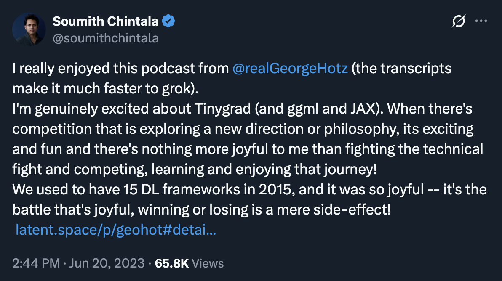
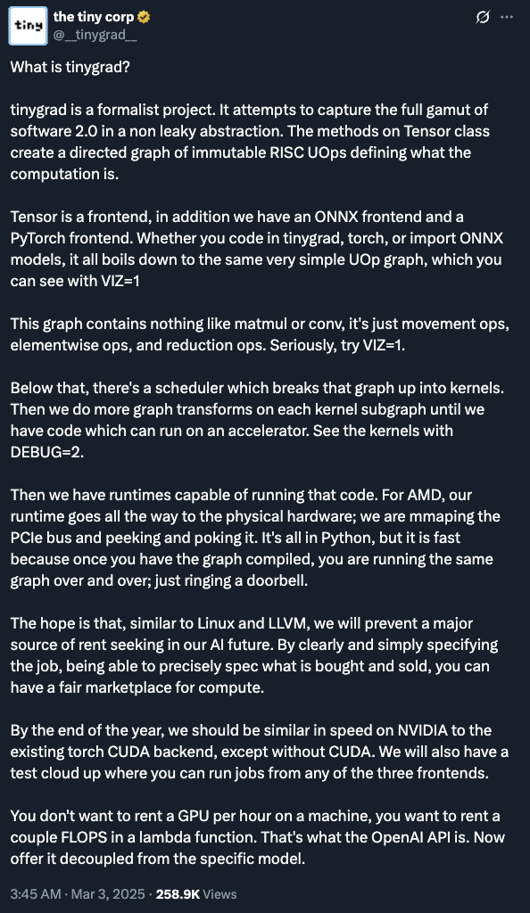

> *Dreams. Each man longs to pursue his dream.* — Guts
# Preface: au-197
**This chapter introduces the golden age of systems ml and provides a course overview**

## Golden Age — Software 2.0 Infrastructure Buildout

Throughout the past decade, modern day AI infrastructure has rapidly evolved
to meet the needs of deep neural networks — most notably with the throughput
performance of GPUs moving from `TFLOPS` to `PFLOPS`. Datacenter
computing now has the goal of a machine with `EFLOPS` speed, now that that
the throughput of the fastest (non-distributed) supercomputers on TOP500 LINPACK
workloads are just reaching `EFLOP` levels.

---

### 1 second version
SOTA semiconductor physics is forcing both languages and machines to be redesigned
from frist principles. This creates a golden age for compiler engineers and
computer architects who need to software-hardware codesign the machines of tomorrow.

*Welcome to the golden age of Systems ML!*

---

### 1 minute version
Although the brain is an existence proof of physics powering `20PFLOP` machines
with `20W`, the problem with the semiconductor physics of *today* is two-fold:
1. instruction-level parallelism from out-of-order superscalar pipelines hits diminishing returns
2. frequency scaling is hitting against [Dennard scaling](https://en.wikipedia.org/wiki/Dennard_scaling)'s power wall

and so this free-single-thread-performance-lunch aspect to [Moore's law](https://en.wikipedia.org/wiki/Moore%27s_law)
that transitioned us across computer classes from minis to micros and from micros
to mobile is "over".

As a result computer architects are moving from homogenous general hardware
to heterogenous specialized hardware, which means that the complexity of extracting
program performance leaks upwards from the hardware — these days, to unlock
the full performance of hardware, it's the programmer's responsibility to program
the vector processors in multi-core/many-core machines.

The problem with the vector processing of multi-core/many-core machines is two-fold:
1. programming model: compilers were [sufficiently smart](https://wiki.c2.com/?SufficientlySmartCompiler) with [autovectorization](https://pharr.org/matt/blog/2018/04/18/ispc-origins)
2. execution model: program speedups were bound by [Amdahl's law](https://en.wikipedia.org/wiki/Amdahl%27s_law)

But the industry sidestepped these problems by changing the programming model to
SIMT on SIMD (CUDA) and finding domains whose execution models had more parallelism
(deep neural networks).

The challenge (producing a golden age) of compiler engineers and chip architects face is to find the optimal mapping from
intelligence to energy. This means creating new programming languages and machiens
while minimizing the accidental complexity that naturally builds up along the way:

- [The Golden Age of Compiler Design (Lattner)](https://www.youtube.com/watch?v=4HgShra-KnY)
- [A New Golden Age for Computer Architecture (Hennessy and Patterson)](https://www.youtube.com/watch?v=3LVeEjsn8Ts)

*Welcome to the golden age of Systems ML!*

---

### 10 minute version

The [Singularity Systems: Zero to Hero](./syllabus.md) course follows up from
where [Neural Networks: Zero to Hero](https://karpathy.ai/zero-to-hero.html)
left off: we will convert `micrograd` into `picrograd`, where the main difference is that:
- [micrograd](https://github.com/karpathy/micrograd) is a backprop engine with scalar-support helping researchers  understand that backpropagation as an abstraction is in fact leaky (gradient activations, normalizations)
- [picograd](https://github.com/j4orz/picograd) leans closer towards modern day deep learning frameworks with tensor-support for both pytorch1 interpretation and pytorch2 compilation.

While `picograd` is more oriented towards low-level system programmers and
performance engineers, this framework remains *pedagogical* and remains a
point-wise compiler. This means that we will "only" support:
- **3 models**: llama, stable diffusion, whisper
- **1 programming model**: eager
- **2 execution model**: eager, graph
- **2 hardware architectures**: amd cpu, nvidia gpu
- **2 precisions**: fp32, tf32

The astute reader will point out that besides the unlock of hardware performance
itself, the secondary benefit compilers bring to the table is the *portability*
of said-performance. While this is true from theoretical normative perspective,
in practice, the industry does not have *performance-portability* with vector
nor tensor programs on vector processors (GPUs) — standing in contrast to
scalar programs on scalar processors (CPUs).

Colloquially, the industry's lack of *performance-portability* is also known as
**the cuda moat**. This is because the cheapest path to maximize performance
measured in `FLOP/S/W` or `BW/S/W` is done with NVIDIA's vector processors, where
the normalizing term of cost denominated in energy also includes the operational
expenditure required to hire kernel engineers for each new A100/H100/B100 generation.

So with that being said, although the gold standard for compiler construction
would unlock both 1. performance and 2. performance-portability, given that the
industry itself has not even reached the second bar, we will provide ramps to
*performance-portability* by comparsing and contrasting the implementation of
*picograd* to *tinygrad*, a framework trying to unlock that portability —
colloquially known as **comoditizing the petaflop**.

The core design decision that tinygrad makes in order to differentiate itself
from pytorch and friends is bringing back *search* at the systems level
pioneered by [halide](https://people.csail.mit.edu/jrk/halide-pldi13.pdf) and
[tvm](https://arxiv.org/abs/1802.04799). Although many research scientists
espouse the "learning and search" wisdom from
[the Bitter Lesson](http://www.incompleteideas.net/IncIdeas/BitterLesson.html),
the jury is still out whether search works at the systems level given that
empirically, it's failed in the past (i.e. the addition of tensor cores to the
underlying hardware is one of the main reasons attributed towards tvm's "failure"),
and in the present, tinygrad is still underperforming pytorch on NVIDIA hardware.

But even with all that being said with respect to the technical design decisions
being made, what's more relevent and compelling to the Singularity Systems course
is the philosophical engineering decision tinygrad is making: **to surface complexity**.

The PyTorch project is 3,327,184 lines of code across 11,449 files while the
tinygrad project is 296,447 across 865 files (where source is further limited
to 13k lines of code). Assuming PyTorch's non-source/source ratio is in the same ballpark
as tinygrad's then this implies there's around 100,000 lines of PyTorch source,
and so measured in lines of code in both non-source and source, PyTorch has 10x more
complexity than tinygrad.

And so although there does exist this argument that PyTorch provides a more
batteries-included experience, using tinygrad's implementation as a case-study
is more well-suited to the goals of this course. In all three chapters, we will
walk through [picograd]()'s implementation, and then compare it to that of [tinygrad]()'s.

*Welcome to the golden age of Systems ML!*

### 1(0) year version
Although the Singularity Systems course points towards tinygrad as a system
attempting to ammend the industry's lack of *performance-portability* (removing the
"cuda moat" by "comoditizing the petaflop"), there are other possible solutions
that take a broader view. Rather than building a new framework or domain specific
language, perhaps new programming and execution models implemented as new
languages and machines for parallel computing should be built.

And this is exactly what companies like Mojo and Tenstorrent are doing — they are
re-industrializing research ideas from the unsolved world of parallel computing.
The former riffing on ideas from comptime metaprogamming pioneered by Zig, and
the latter on ones from CELL/Larabee tensor processing.

<!-- Jax+XLA is better on TPUs.
PyTorch+Inductor is better on NV.
both have poor performance (for complex workloads) AMD.

fragmentation. no shared
accidental complexity in non-differentiated components ==> FLOPS/W or FLOPS/$
hardware is getting harder.
tt chasing sanity. amd following nv. todo: jim keller economic law?? ai first time it didn't get cheaper?
nv: "moat". "Swamp" of kernel authoring. sidestepped the issue. potential to bite them in butt. impedence mismatch.
todo: mojo 9part blog
the accidental complexity of impedence mismatch (programming graphs on vector processors)
is making it non-general

general: is when a library is modular so you can mix-match the components for applications
that the library designer never thought of.
for instance: LLVM as a modular compiler infrastructure. Clang (OpenCL), Swift Julia Rust etc.
what if there are other graph-related workloads that 

what this course is going to introduce today's solutions. subset deep learning frameworks.
but will end up exploring preparing you for the future of tomorrow. mojo and tenstorrent?
unsolved problem of parallel computing.
-> raph levien's notes and links.

course is only covered to a single machine (scale up)
perhaps a v2 course offering can provide multi-machine distributed systems (scale out).
-> intersection of graph compilers and distributed systems.

programming an M1 and a whatever1 feel relative the same.
the hardware/software contract is pretty clean for scalar computing
and does not leak complexity up the stack.

the same cannot be said for unlocking the performance of modern day for
vector processors and tensorprocessors. you have to know about (come back here:
TMA, X, Y, Z)

So although the course "only" builds a point-wise solution, we will make the
connections to how production-level language implementations (PyTorch and friends)
handle the problem of generitization so tha

Deep learning (and graphics) are enjoying 10-100x more perf(throughput) of GPUs/TPUs,
but it's very expensive so can we make it more cheaper (efficient) `FLOP/W` or `FLOP/$` for existing AI/graphics workloads?
-> which might have downstream effects of unlocking FLOP/S to any compute that
can be expressed as a graph.

programming model implemented by interpreter/compiler. "only" achieving 50% utilization
execution model implemented by chip: graph programs on vector processors

CONCLUSION: lots of accidental complexity arisen (genius workaround at first but now ducktaping)

SOLUTIONs today: graph compilers, kernel authoring: CUBLAS, CUDNN,
SOLUTIONS tmr: mojo/apl/futhark (metaprogramming with comptime), tenstorrent/cell (dataflow computing)

we will build a poitn-wise (1 model, 1 framework, 1 hardware) solution picograd
built that were hillclimbed from yesterdays solutions:

*Welcome to the golden age of Systems ML!* -->