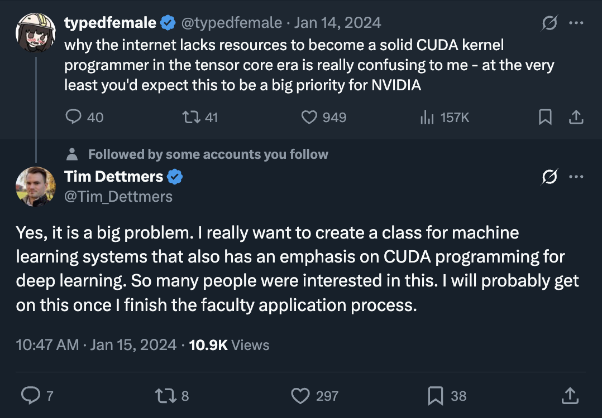
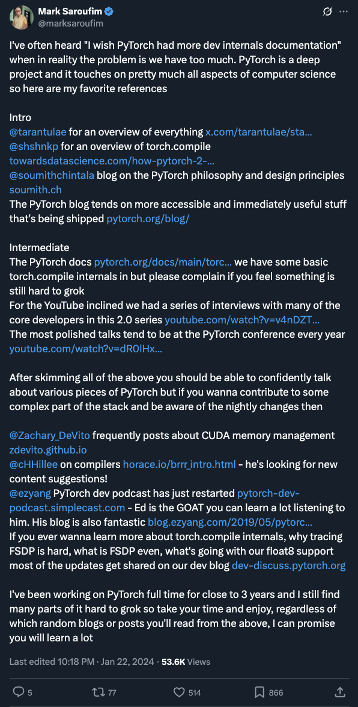

# Singularity Systems: Zero to Hero
*Dragon Book 2.0: The Hacker's Guide to Tensor Compilers*

## Course Description
Singularity Systems: Zero to Hero follows up from
[Neural Networks: Zero to Hero](https://karpathy.ai/zero-to-hero.html). We convert
- [**micrograd**](https://github.com/karpathy/micrograd): toy backpropagation engine *into...*
- [**picograd**](https://github.com/j4orz/picograd): modern deep learning framework

While micrograd helps research scientists to understand the leaky abstraction of
backpropagation, picograd is intended for systems programmers and performance
engineers looking to further understand the compilers and chips of deep learning.

### Prerequisites
- solid deep learning (sd && llama)
- solid systems programming (C || C++ || Rust)

### Syllabus v1: scale-up
**Core**: *Deep Learning Compilers of Today*

1. **dfdx(nd)**: implements an interpreter for neural networks (HIPS/autograd)
2. **brrr**: accelerates the interpreter with vector processing (pytorch1)
3. **pt2**: constructs a compiler for neural networks (pytorch2)

**Appendix**: *Speedrunning Prerequisites*
-  **A: soul**: speedruns an optimizing compiler (c -> riscv)
-  **B: s2.0**: speedruns ffn -> rnn -> lstm -> xf

### Syllabus v2: scale-out
1. distributed systems

### Syllabus v3: beyond cuda
1. parallel programming models: mojo/futhark/apl
2. parallel execution models: tenstorrent/cell/larabee/cray

### Citation
```
@article{j4orz2025singsys,
  author  = "j4orz",
  title   = "Singularity Systems: Zero to Hero",
  year    = "2025",
  url     = "https://j4orz.ai/zero-to-hero/"
}
```

### Elevator Pitch: Have no fear, Singularity Systems is here!
*Singularity Systems: Zero to Hero bridges the gap from blog/podcast to phd thesis*




